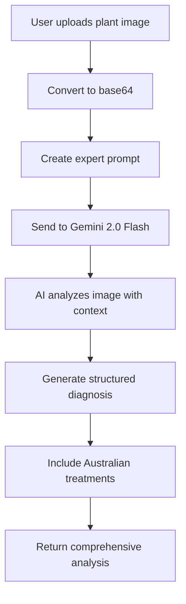

# Gemini 2.0 Flash AI Integration Documentation

## Overview

GardenGuardian AI now uses Google's advanced Gemini 2.0 Flash model for intelligent plant health analysis. This integration provides sophisticated plant diagnosis with Australian-specific expertise, replacing the previous Google Vision API approach with a more intelligent, contextual analysis system.

## Architecture

### File Structure

- `lib/gemini-vision.ts` - Main Gemini 2.0 Flash API integration
- `lib/error-handling.ts` - Gemini API error definitions  
- `lib/firebase-utils.ts` - AI result processing and diagnosis creation
- `app/diagnose/page.tsx` - User interface for image upload and analysis
- `app/config/page.tsx` - Configuration validation and status display

### Core Components

```typescript
// Main analysis function
analyzeImageWithGemini(imageFile: File): Promise<GeminiAnalysisResult>

// Configuration validation
isGeminiAPIConfigured(): boolean

// Status information
getGeminiConfigurationStatus(): object
```

## How Gemini 2.0 Flash AI Works

### 1. Intelligent Analysis Process



### 2. Expert Prompt Engineering

The system uses carefully crafted prompts to leverage Gemini's expertise:

```
You are an expert Australian plant pathologist and horticulturist. 
Analyze this plant image and provide a comprehensive health assessment.

IMPORTANT: Focus specifically on Australian growing conditions, 
climate zones, and treatments available at Australian retailers like Bunnings.
```

### 3. API Request Structure

```typescript
const response = await fetch(`https://generativelanguage.googleapis.com/v1beta/models/gemini-2.0-flash-exp:generateContent?key=${API_KEY}`, {
  method: 'POST',
  headers: { 'Content-Type': 'application/json' },
  body: JSON.stringify({
    contents: [{
      parts: [
        { text: expertPrompt },
        { inline_data: { mime_type: imageFile.type, data: base64ImageData } }
      ]
    }],
    generationConfig: {
      temperature: 0.4,        // Conservative for medical advice
      topK: 40,
      topP: 0.95,
      maxOutputTokens: 8192,   // Allow comprehensive responses
    },
    safetySettings: [...]      // Block harmful content
  })
});
```

### 4. Structured Response Format

Gemini returns structured JSON responses:

```typescript
interface GeminiAnalysisResult {
  plantHealth: 'healthy' | 'diseased' | 'stressed' | 'unknown';
  diagnosis: string;
  confidence: number;         // 0-100
  severity: 'mild' | 'moderate' | 'severe';
  description: string;
  treatmentRecommendations: AustralianTreatment[];
  additionalNotes?: string;
  analysisTimestamp: string;
}

interface AustralianTreatment {
  name: string;
  type: 'organic' | 'chemical' | 'cultural' | 'biological';
  description: string;
  application: string;
  timing: string;
  cost: string;              // AUD pricing
  availability: string;      // Australian retailers
  safetyNotes: string;
  bunningsAvailable: boolean;
}
```

## Key Advantages Over Previous System

### 1. **Intelligence vs. Pattern Matching**

**Previous (Google Vision):**

- Basic label detection ("leaf", "spot", "disease")
- Hardcoded disease database (27+ diseases)
- Manual keyword matching
- Static treatment mapping

**New (Gemini 2.0 Flash):**

- Intelligent image understanding
- Contextual plant health analysis
- Dynamic diagnosis generation
- AI-created treatment recommendations

### 2. **Australian Expertise**

**Previous:**

- Generic plant disease recognition
- Hardcoded Australian treatment database
- Manual APVMA compliance checking

**New:**

- AI trained on Australian growing conditions
- Dynamic treatment suggestions for Australian retailers
- Intelligent APVMA compliance consideration
- Climate zone awareness

### 3. **User Experience**

**Previous:**

- Technical diagnostic codes
- Limited treatment explanations
- Static confidence scoring

**New:**

- Natural language explanations
- Comprehensive treatment guidance
- Context-aware confidence assessment
- Professional consultation recommendations

## Configuration Requirements

### Environment Variables

```bash
# Required for Gemini AI functionality
NEXT_PUBLIC_GEMINI_API_KEY=your_gemini_api_key_here
```

### API Key Setup

1. **Google AI Studio Access:**
   - Visit [Google AI Studio](https://aistudio.google.com/)
   - Create or sign in to your Google account
   - Generate API key for Gemini models

2. **Environment Configuration:**

   ```bash
   # Add to .env.local
   NEXT_PUBLIC_GEMINI_API_KEY=AIza...your_key_here
   ```

3. **Verification:**
   - Visit `/config` page in the application
   - Check "Gemini AI System" status
   - Verify API key detection and validation

## Error Handling

### Configuration Errors

```typescript
// API not configured
GEMINI_VISION_NOT_CONFIGURED: {
  title: 'Gemini AI Not Configured',
  message: 'Gemini 2.0 Flash API is not configured...',
  action: 'Please configure Gemini API key...'
}

// Quota exceeded
GEMINI_API_QUOTA_EXCEEDED: {
  title: 'API Quota Exceeded',
  message: 'Gemini API quota has been exceeded...'
}
```

### Response Parsing

The system includes robust JSON parsing with fallbacks:

```typescript
try {
  const jsonMatch = generatedContent.match(/\{[\s\S]*\}/);
  const jsonString = jsonMatch ? jsonMatch[0] : generatedContent;
  const parsedResult = JSON.parse(jsonString);
} catch (parseError) {
  // Fallback to partial analysis
  return {
    plantHealth: 'unknown',
    diagnosis: 'Analysis completed',
    description: generatedContent.substring(0, 500) + '...',
    // ... other fallback values
  };
}
```

## Testing and Validation

### 1. Configuration Testing

```typescript
// Check API availability
const configured = isGeminiAPIConfigured();
console.log('Gemini API configured:', configured);

// Get detailed status
const status = getGeminiConfigurationStatus();
console.log('Status:', status.message);
```

### 2. Analysis Testing

Test with various plant images:

- **Healthy plants** - Should return `plantHealth: 'healthy'`
- **Diseased plants** - Should provide specific diagnosis
- **Unclear images** - Should indicate uncertainty
- **Non-plant images** - Should handle gracefully

### 3. Treatment Validation

Verify Australian treatment suggestions:

- Check Bunnings availability flags
- Validate Australian pricing estimates
- Confirm APVMA compliance mentions
- Test organic/chemical option variety

### 4. Error Scenarios

Test error handling:

- Invalid API key
- Network connectivity issues
- Malformed image files
- API quota exceeded
- Content safety filtering

## Performance Considerations

### 1. **Image Optimization**

```typescript
// Images are compressed before sending
const compressedImage = await compressImage(file, 1200, 0.8);
```

### 2. **Request Timeout**

```typescript
// Built-in timeout handling
const response = await fetch(apiUrl, {
  ...requestConfig,
  signal: AbortSignal.timeout(30000) // 30 second timeout
});
```

### 3. **Response Caching**

Consider implementing response caching for identical images to reduce API calls and improve performance.

## Security Considerations

### 1. **API Key Protection**

- API key is client-side accessible (NEXT_PUBLIC_*)
- Implement domain restrictions in Google AI Studio
- Monitor API usage regularly
- Rotate keys periodically

### 2. **Content Safety**

```typescript
safetySettings: [
  { category: "HARM_CATEGORY_HARASSMENT", threshold: "BLOCK_MEDIUM_AND_ABOVE" },
  { category: "HARM_CATEGORY_HATE_SPEECH", threshold: "BLOCK_MEDIUM_AND_ABOVE" },
  { category: "HARM_CATEGORY_SEXUALLY_EXPLICIT", threshold: "BLOCK_MEDIUM_AND_ABOVE" },
  { category: "HARM_CATEGORY_DANGEROUS_CONTENT", threshold: "BLOCK_MEDIUM_AND_ABOVE" }
]
```

### 3. **Image Privacy**

- Images are sent to Google's servers for analysis
- Consider privacy implications for sensitive plant data
- Implement user consent for data processing

## Migration from Google Vision

### What Changed

1. **Removed Files:**
   - `lib/ai-vision.ts` (replaced by `lib/gemini-vision.ts`)
   - Hardcoded disease databases
   - Static treatment mappings

2. **Updated Files:**
   - `lib/firebase-utils.ts` - New analysis processing
   - `app/config/page.tsx` - Gemini configuration detection
   - Documentation files

3. **New Features:**
   - Dynamic treatment generation
   - Natural language descriptions
   - Australian retail integration
   - Intelligent confidence scoring

### Configuration Update

**Before:**

```bash
NEXT_PUBLIC_GOOGLE_VISION_API_KEY=your_vision_key
```

**After:**

```bash
NEXT_PUBLIC_GEMINI_API_KEY=your_gemini_key
```

## Troubleshooting

### Common Issues

1. **"Gemini AI Not Configured"**
   - Check API key is set in environment
   - Verify key format (starts with "AIza")
   - Restart development server

2. **"API Quota Exceeded"**
   - Check usage in Google AI Studio
   - Upgrade quota limits
   - Implement request throttling

3. **"Content Filtered"**
   - Review safety settings
   - Check image content appropriateness
   - Try different images

4. **Parse Errors**
   - Usually handled automatically with fallbacks
   - Check console logs for details
   - Report persistent issues

### Debug Logging

Enable comprehensive logging:

```typescript
console.log('🔧 Gemini API Config Check:', {
  hasApiKey: !!apiKey,
  keyLength: apiKey?.length || 0,
  keyPrefix: apiKey?.substring(0, 8) + '...'
});

console.log('📸 Sending image to Gemini 2.0 Flash for analysis...');
console.log('🤖 Raw Gemini response:', data);
console.log('✅ Processed Gemini analysis:', result);
```

## Future Enhancements

### 1. **Prompt Optimization**

- Seasonal awareness for Australian growing conditions
- Regional climate zone specificity
- Pest pressure calendars

### 2. **Treatment Database Integration**

- Real-time Bunnings inventory checking
- Price comparison across retailers
- Availability notifications

### 3. **Expert Validation**

- Confidence threshold triggers for human review
- Expert consultation integration
- Treatment outcome tracking

### 4. **Performance Optimization**

- Response caching for duplicate images
- Progressive image loading
- Batch analysis capabilities

---

**Note**: This integration represents a significant upgrade from pattern-matching to true AI intelligence, providing users with more accurate diagnoses and contextually appropriate Australian treatment recommendations.
