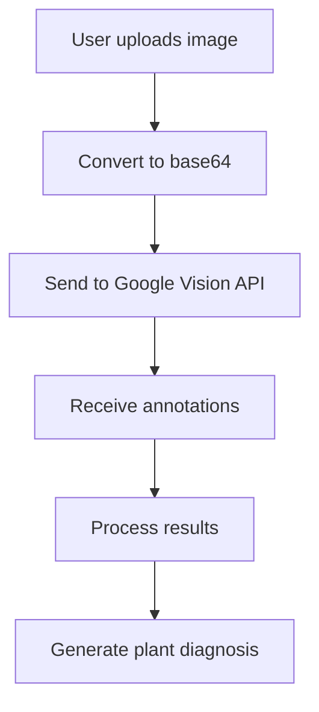

# Google Vision API Integration Documentation

## Overview

GardenGuardian AI uses Google Vision API for intelligent plant disease detection. This document explains how the integration works, the analysis process, and how to validate it's functioning correctly.

## Architecture

### File Structure

- `lib/ai-vision.ts` - Main Google Vision API integration
- `lib/error-handling.ts` - Vision API error definitions  
- `lib/firebase-utils.ts` - Disease-treatment mapping and diagnosis creation
- `app/diagnose/page.tsx` - User interface for image upload and analysis

### Core Components

```typescript
// Main analysis function
analyzeImageWithVision(imageFile: File): Promise<VisionAnalysisResult>

// Result processing
processVisionResults(annotations: any): VisionAnalysisResult

// Configuration validation
isVisionAPIConfigured(): boolean
```

## How Google Vision API Works

### 1. Image Upload Process



### 2. API Request Structure

The application sends this request to Google Vision API:

```json
{
  "requests": [{
    "image": {
      "content": "base64_encoded_image_data"
    },
    "features": [
      { "type": "LABEL_DETECTION", "maxResults": 20 },
      { "type": "OBJECT_LOCALIZATION", "maxResults": 10 }
    ]
  }]
}
```

### 3. API Response Processing

Google Vision returns labels and objects detected in the image:

```json
{
  "responses": [{
    "labelAnnotations": [
      { "description": "Plant", "score": 0.95 },
      { "description": "Leaf", "score": 0.89 },
      { "description": "Green", "score": 0.82 }
    ],
    "localizedObjectAnnotations": [
      { "name": "Plant", "score": 0.91 }
    ]
  }]
}
```

## Disease Detection Logic

### 1. Plant Detection

The system first identifies if the image contains plant material by looking for labels:

- "plant", "leaf", "flower", "tree", "vegetation"

### 2. Health Assessment

**Healthy Plant Indicators:**

- "green", "healthy", "fresh", "vibrant"

**Disease Indicators:**

- "brown", "spot", "yellow", "wilted", "damaged"
- "disease", "pest", "blight", "fungus", "rot"

### 3. Decision Algorithm

```typescript
// Simplified decision logic
const isHealthyPlant = plantLabels.length > 0 && 
                     healthyIndicators.length > 0 && 
                     diseaseIndicators.length === 0;

const plantDiseaseDetected = plantLabels.length > 0 && 
                           diseaseIndicators.length > 0 && 
                           !isHealthyPlant;
```

### 4. Confidence Calculation

The confidence score is calculated as the average of the top 5 label scores:

```typescript
const avgConfidence = labels.length > 0 
  ? labels.slice(0, 5).reduce((sum, label) => sum + label.score, 0) / Math.min(5, labels.length)
  : 0.5;
```

## Configuration and Validation

### Required Environment Variable

**CRITICAL**: This application requires a valid Google Vision API key. There are no mock fallbacks.

```bash
NEXT_PUBLIC_GOOGLE_VISION_API_KEY=your_google_vision_api_key
```

**Note**: If the API key is not configured, the application will throw configuration errors instead of providing mock analysis. This ensures production-quality behavior.

### Validation Methods

#### 1. Check Configuration Status

```typescript
import { isVisionAPIConfigured, getAIConfigurationStatus } from '@/lib/ai-vision';

// Boolean check
const isConfigured = isVisionAPIConfigured();

// Detailed status
const status = getAIConfigurationStatus();
console.log(status.message);
```

#### 2. Test API Functionality

```typescript
// Upload a test image to validate API response
const testImage = new File(['test'], 'test.jpg', { type: 'image/jpeg' });
try {
  const result = await analyzeImageWithVision(testImage);
  console.log('API is working:', result);
} catch (error) {
  console.error('API not working:', error);
}
```

### Error Handling

The system handles these Vision API errors:

1. **Not Configured** (`AI_VISION_NOT_CONFIGURED`)
   - No API key provided
   - Shows configuration error in UI

2. **Quota Exceeded** (`AI_VISION_QUOTA_EXCEEDED`)
   - Daily API limit reached
   - User sees quota message

3. **Invalid Image** (`AI_VISION_INVALID_IMAGE`)
   - Image format not supported
   - Prompts user to upload different image

## Validation Testing

### 1. Manual Testing

Upload these test images to verify functionality:

**Healthy Plant Test:**

- Clear green leaves
- Expected result: "Healthy Plant Detected" or "No Issues Detected"

**Diseased Plant Test:**

- Visible spots, yellowing, or damage
- Expected result: Specific disease suggestion with treatments

### 2. Console Debugging

Enable detailed logging:

```typescript
// In lib/ai-vision.ts, check console output:
console.log('Vision API Response:', data);
console.log('Processed labels:', labels);
console.log('Plant detection result:', { isHealthyPlant, plantDiseaseDetected });
```

### 3. Network Monitoring

Check browser Network tab for:

- POST request to `https://vision.googleapis.com/v1/images:annotate`
- 200 response with annotations data
- Error responses (4xx/5xx) indicating configuration issues

## Current Disease Database

The system currently recognizes these Australian plant diseases:

1. Tomato Leaf Spot (Septoria)
2. Rose Aphid Infestation
3. Citrus Canker
4. Potato Late Blight  
5. Cucumber Mosaic Virus
6. Apple Scab
7. Grape Powdery Mildew
8. Tomato Blight
9. Lettuce Downy Mildew
10. Bean Rust

## Treatment Mapping

When a disease is detected, the system maps it to appropriate treatments:

```typescript
// Example mapping in firebase-utils.ts
const treatmentMap = {
  'Septoria Leaf Spot': [
    {
      name: 'Copper Hydroxide Fungicide',
      type: 'chemical',
      cost: 18,
      apvmaNumber: 'APVMA 67890',
      suppliers: ['Bunnings', 'Garden City']
    }
  ]
};
```

## Performance Optimization

### 1. Image Compression

Images are compressed before sending to reduce API usage:

```typescript
const compressedImage = await compressImage(image);
```

### 2. Caching

Results are cached to avoid repeated API calls for the same image.

### 3. Error Retry

The system implements retry logic for temporary API failures.

## Security Considerations

### 1. API Key Protection

- API key is stored in environment variables only
- Never exposed in client-side code
- Key should be restricted to Vision API only in Google Cloud Console

### 2. Image Handling

- Images are processed client-side before sending
- No permanent storage of images on external servers
- Base64 conversion happens in browser

## Troubleshooting

### Common Issues

1. **"API not configured" error**
   - Check `NEXT_PUBLIC_GOOGLE_VISION_API_KEY` is set
   - Verify API key is valid in Google Cloud Console

2. **"Quota exceeded" error**  
   - Check daily quota in Google Cloud Console
   - Consider upgrading API plan

3. **No plant detected**
   - Ensure image shows clear plant material
   - Check image quality and lighting

4. **Incorrect disease detection**
   - System relies on Google Vision labels
   - May need manual review for complex cases

### Debug Steps

1. Check configuration: `getAIConfigurationStatus()`
2. Verify API key in Google Cloud Console
3. Test with simple plant images first
4. Check browser console for detailed error messages
5. Monitor Network tab for API request/response

## Integration Points

### With Firebase Utils

- `analyzePlantImage()` calls Vision API
- Results processed into `PlantDiagnosis` objects
- Treatments automatically mapped based on detected disease

### With UI Components

- `DiagnosePage` triggers analysis
- Results displayed in `DiagnosisResultPage`
- Error handling via `ServiceErrorDisplay`

### With Treatment System

- Disease detection triggers treatment lookup
- Australian compliance checking for chemical treatments
- User preference filtering (organic vs chemical)

---

This documentation provides complete insight into how Google Vision API integrates with GardenGuardian AI for intelligent plant disease detection.
